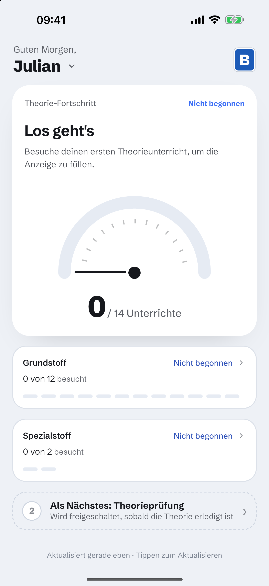
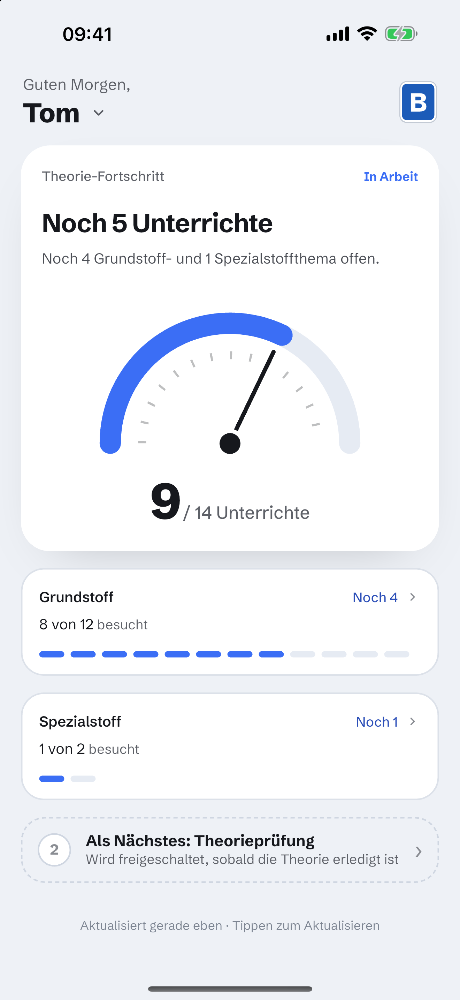
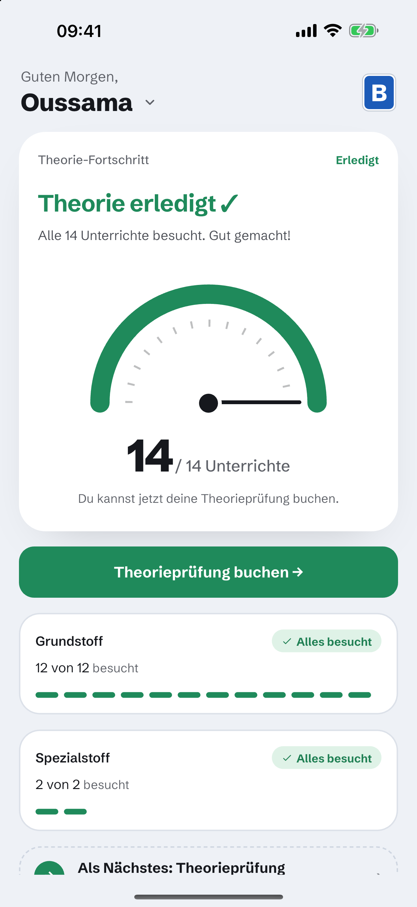
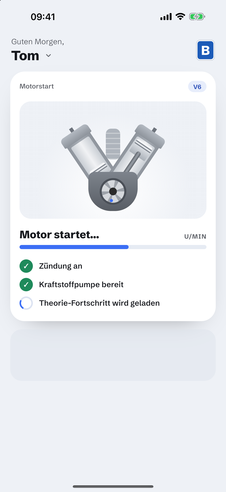
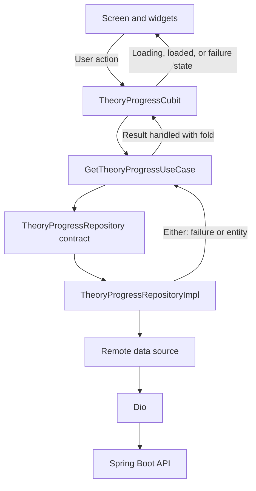

# Theory Progress

Theory Progress is a German Flutter application that shows a Class B driving
student's theory attendance using a separate Spring Boot backend. It implements
the frontend interview task: progress for basic and special topics, clear
completion status, loading, and recoverable errors.

The project follows a layer-based clean architecture with `core`, `data`,
`domain`, and `presentation`. The goal is readable code, explicit responsibilities,
and a small set of meaningful tests.

## Features

- Display basic and special attendance with counts, segments, and an animated gauge.
- Show `Theorie erledigt ✓` when the API reports overall completion.
- Mark each completed section independently while keeping the overall API status.
- Show zero attendance as normal progress, including `0 von 12` and `0 von 2`.
- Animate the supplied engine illustration while loading.
- Refresh by pulling down or tapping the update timestamp.
- Handle missing students separately from network and server failures, with `Erneut versuchen`.
- Switch demo students by tapping the name in the header.
- Open section progress sheets with expandable answers and a road-to-licence sheet.
- Show a German toast when the completed-state booking button is tapped.
- Support German accessibility labels, larger text, and reduced motion.

The targets are iPhone 17 Pro Max and an Android simulator. Login, navigation to
other pages, a topic detail list, and real exam booking are outside this prototype.
Web and desktop are not supported targets.

## Screenshots

Fresh captures from the iPhone 17 Pro Max simulator, at 1320 × 2868 pixels.
Attendance comes from the live API; the loading image captures the engine during
a real student-selection request.

| Empty | In progress | Complete | Loading |
| --- | --- | --- | --- |
|  |  |  |  |

## Architecture



- **Core** contains configuration, plain Dart failures, the use-case base,
  dependency registration, German strings, and design tokens.
- **Domain** owns entities, progress rules, the repository contract, and the use
  case. It has no Flutter or Dio dependencies.
- **Data** requests the API, parses handwritten models, converts them to entities,
  and translates transport or malformed-response errors into `AppFailure` types.
- **Presentation** contains the Cubit, immutable states, screen, and widgets.
  Cubit prepares display values and copy; widgets render them and forward actions.

### Key implementation choices

- `flutter_bloc` is used with Cubit for the screen's small set of commands and states.
- Repositories and use cases return `Either<AppFailure, TheoryProgress>`; Cubit
  handles both outcomes with `fold`.
- GetIt registration lives in `lib/core/di/injection_container.dart`. Dependencies
  are passed through constructors, and `BlocProvider` creates and disposes Cubit.
- Models use manual `fromJson`, `toJson`, and `toEntity` methods. There is no
  separate mapper layer or generated model code.
- German product and accessibility copy lives in `AppStrings`. Colors, typography,
  dimensions, and animation values are centralized under `core/theme`.
- Sheet visibility, toast lifetime, and animation controllers stay in local UI state.
- Schibsted Grotesk is bundled with its [SIL Open Font License](assets/fonts/OFL.txt).
  The engine uses supplied PNG parts and Flutter animations; the gauge uses a
  custom painter.

## API and State Handling

The backend exposes one endpoint without authentication:

```http
GET /api/students/{id}/theory-progress
```

Example response:

```json
{
  "studentId": "3",
  "studentName": "Oussama",
  "licenseClass": "B",
  "basicTopics": {"attended": 12, "required": 12},
  "specialTopics": {"attended": 2, "required": 2},
  "completed": true
}
```

The API's `completed` field controls overall status and booking eligibility.
Each section is complete when `attended >= required`. Requirements and totals
come from the response; the app does not hardcode 12, 2, or 14. Raw attendance
counts are preserved, visual fill is clamped, and remaining counts never become
negative. Surplus attendance in one section cannot satisfy the other section.

An unknown student returns HTTP 404 with a body such as:

```json
{"message":"Student '999' not found"}
```

The app displays its German not-found message instead of the raw backend text.
Other HTTP errors, connection failures, and invalid responses become typed
failures with German explanations and a retry action. Dio has separate
10-second connection, send, and receive timeouts.

Loading is visible for at least 800 ms. That timer runs concurrently with the
request, so a slower response does not incur another 800 ms afterward. Switching
students ignores results from older requests, and closing Cubit prevents later
emissions. Refresh and retry keep the selected student identity.

The update timestamp is the client's successful response time. Its relative
label updates every minute and when the app resumes. Student names are cached
in memory; failed lookups or blank names use `Fahrschüler {id}`. There is no
persistent progress cache or offline browsing. Refresh replaces the previous
progress with the loading state.

## Folder Structure

```text
theory_demo_frontend/
├── assets/
│   ├── engine/                 # PNG parts with 2.0x and 3.0x variants
│   └── fonts/                  # Bundled font files and licence
├── docs/                       # iOS state screenshots
├── lib/
│   ├── main.dart
│   ├── app.dart
│   ├── core/
│   │   ├── config/
│   │   ├── constants/
│   │   ├── di/
│   │   ├── errors/
│   │   ├── network/
│   │   ├── theme/
│   │   └── usecases/
│   ├── data/
│   │   ├── datasources/
│   │   ├── models/
│   │   └── repositories/
│   ├── domain/
│   │   ├── entities/
│   │   ├── repositories/
│   │   └── usecases/
│   └── presentation/
│       ├── cubits/theory_progress/
│       ├── screens/
│       └── widgets/
├── test/
│   ├── data/
│   ├── domain/
│   ├── presentation/
│   └── support/
├── pubspec.yaml
└── README.md
```

## Dependencies

| Package | Purpose |
| --- | --- |
| `flutter_bloc` | Cubit state management and widget integration. |
| `equatable` | Value equality for entities, parameters, and states. |
| `dio` | HTTP requests, timeouts, and transport errors. |
| `dartz` | Explicit success/failure results with `Either` and `fold`. |
| `get_it` | Central dependency registration. |
| `flutter_test` | Unit and widget tests using small fakes. |
| `flutter_lints` | Static analysis rules. |

There are no code-generation, router, localization, font-download, or external
animation packages. No `build_runner` or `gen-l10n` step is required.

## Setup

The app was verified with **Flutter 3.35.4 / Dart 3.9.2**. Use Xcode on macOS for
the iOS simulator, or an Android SDK and emulator. The separate backend requires
**JDK 25** and includes a Gradle wrapper.

1. From the frontend checkout, check the toolchain and install dependencies:

   ```sh
   flutter doctor
   flutter pub get
   flutter devices
   ```

2. In another terminal, from the backend checkout, start the API:

   ```sh
   ./gradlew bootRun
   ```

   It listens on port **8080** with the current configuration. Verify it from
   the host machine:

   ```sh
   curl http://localhost:8080/api/students/3/theory-progress
   ```

3. Start a target simulator and run the frontend using its ID from `flutter devices`.

## Running the App

The default API URL depends on the target platform:

| Target | Default API base URL |
| --- | --- |
| iOS simulator | `http://localhost:8080` |
| Android emulator | `http://10.0.2.2:8080` |

```sh
flutter run -d <simulator-device-id>
```

Configuration is supplied at build time through Dart defines:

| Define | Default | Purpose |
| --- | --- | --- |
| `API_BASE_URL` | Platform URL above | Backend base URL, without the endpoint path. |
| `STUDENT_ID` | `1` | Initial student to fetch. |
| `DEMO_MODE` | `true` in debug; `false` in profile/release | Enable the name-tap student selector. |

Explicit iOS example:

```sh
flutter run -d <ios-simulator-id> \
  --dart-define=API_BASE_URL=http://localhost:8080 \
  --dart-define=STUDENT_ID=3 \
  --dart-define=DEMO_MODE=true
```

Explicit Android example:

```sh
flutter run -d <android-emulator-id> \
  --dart-define=API_BASE_URL=http://10.0.2.2:8080 \
  --dart-define=STUDENT_ID=2 \
  --dart-define=DEMO_MODE=true
```

Restart `flutter run` after changing a define; hot reload does not replace the
build-time configuration. Android allows HTTP only for the emulator host and
loopback addresses. iOS permits local networking. Use HTTPS for a remote API.

### Demo students

Tap the student name to open the anchored menu, which lists the other students.
The current backend seeds are:

| ID | Name from API | Basic topics | Special topics | State |
| --- | --- | --- | --- | --- |
| `1` | Julian | 0 / 12 | 0 / 2 | Empty attendance |
| `2` | Tom | 8 / 12 | 1 / 2 | In progress |
| `3` | Oussama | 12 / 12 | 2 / 2 | Complete |

Only IDs are configured in the frontend. Names are fetched from the endpoint;
a failed name lookup keeps that student selectable using the fallback label.
Selection fetches fresh progress. Restarting the app returns to `STUDENT_ID`.
Only-one-section-complete scenarios are covered by test fixtures because the
current backend seeds do not include them.

To demonstrate the real 404 response:

```sh
flutter run -d <simulator-device-id> --dart-define=STUDENT_ID=999
```

To demonstrate a connection error on iOS, use an unused local port:

```sh
flutter run -d <ios-simulator-id> \
  --dart-define=API_BASE_URL=http://localhost:8081
```

## QA and Testing

```sh
dart format --output=none --set-exit-if-changed lib test
flutter analyze
flutter test
```

The current suite has **41 passing tests**, with clean formatting and zero
analyzer issues. Tests use local fakes and do not require the backend.

| Area | Coverage |
| --- | --- |
| Domain and use case | Zero, partial, section-only and complete progress; API completion precedence; dynamic requirements; surplus attendance; invalid counts; repository forwarding. |
| Data | Manual JSON round-tripping, endpoint contract, entity conversion, mismatched student IDs, and HTTP/network/malformed-response failure mapping. |
| Cubit | Success, retry, minimum loading time, slow and stale requests, disposal, cached names, and timestamp updates. |
| Widgets | German counts and completion wording, booking toast, errors, student selection, blank names, refresh, sheets, large text, reduced motion, and animation lifecycle. |

The app has run against the backend on iPhone 17 Pro Max (iOS 26.5) and an Android
API 36 emulator. Live student switching and refresh were exercised on iOS; the
four screenshots above are fresh iOS captures. Native swipe gestures are covered
by widget tests rather than a manual simulator swipe check. Golden tests, a
dedicated integration suite, and profile-mode performance measurements are deferred.

For a manual walkthrough:

- Switch between the three students and check their counts and overall status.
- Refresh through the timestamp and pull-to-refresh; check the loading transition.
- Open both section sheets, expand answers, switch sections, and dismiss them.
- Open the road sheet and tap the booking button in the completed state. Booking
  shows `Die Prüfungsbuchung ist nicht Teil dieses Prototyps` without navigation.
- Launch with an unknown ID or unused API port, then exercise retry and recovery.
- Check larger system text and reduced motion, including sheet scrolling and dismissal.
